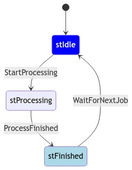

# Berry Finit-State-Machine

Some Berry-Classes, that implement a finit-state-machine.

## Introduction

A Finite State Machine (FSM) is a computational model used to design systems that can be in one of a finite number of states at any given time.

Often used for modeling of control logic, protocols, or workflows.

Key Components of an FSM:

    States: 
        The finite set of conditions or configurations the system can be in. (stIdle, stProcessing ...)

    Transitions: 
        Rules that determine how the system moves from one state to another based on inputs or events. (trStartProcessing..)

    Initial State: The state where the system begins. (default named as stStartup)

## Example

The library for FSM is located in file B03StateMan.be.

The file Demo.be prepares everything to build a FMS with the states : stIdle, stProcessing,stFinished

The transitions are : 

    - trStartProcessing (stIdle => stProcessing)
    - trProcessFinished (stProcessing => stFinished)
    - trWaitForNextJob  (stFinished => stIdle)
 
### Prepare your application

- upload the files 
  - autoexec.be
  - B03StateMan.be
  - Demo.be
  
- restart Tasmota
- after that the state-machine is loaded and started

### Play with the state machine

perform step by step the commands of the file playround.be

